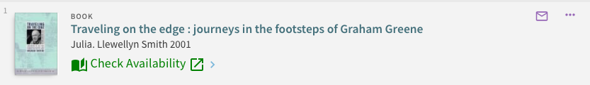
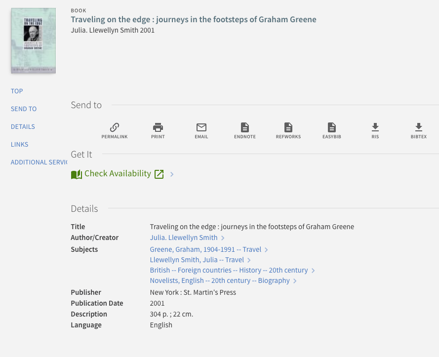

# primo-explore-getit-to-link-resolver

[](https://travis-ci.org/NYULibraries/primo-explore-getit-to-link-resolver)
[](https://www.npmjs.com/package/primo-explore-getit-to-link-resolver)
[](https://coveralls.io/github/NYULibraries/primo-explore-getit-to-link-resolver?branch=master)

## Description

Override the "availability links" section in brief and full results with a link to your link resolver.

### Screenshot

#### Example 1: In brief results


#### Example 2: In full display


## Installation

1. Assuming you've installed and are using [primo-explore-devenv](https://github.com/ExLibrisGroup/primo-explore-devenv).

2. Navigate to your template/central package root directory. For example:
    ```
    cd primo-explore/custom/MY_VIEW_ID
    ```
3. If you do not already have a package.json file in this directory, create one:
    ```
    npm init -y
    ```
4. Install this package:
    ```
    npm install primo-explore-getit-to-link-resolver --save-dev
    ```

## Usage

Once installed, inject `getitToLinkResolver` as a dependency:

```js
let app = angular.module('viewCustom', ['getitToLinkResolver'])
```

**Note:** If you're using the --browserify build option, you will need to first import the module with:

```js
import 'primo-explore-getit-to-link-resolver';
```

This will hide all out-of-the-box availability links on the brief and full view.

### In brief results

If you want the link resolver link in the brief results then add the `getit-to-link-resolver-brief` directive to the `prmSearchResultAvailabilityLineAfter` component:

```js
app.component('prmSearchResultAvailabilityLineAfter', {
  template: '<getit-to-link-resolver-brief></getit-to-link-resolver-brief>'
})
```

### In full display

If you want the link resolver link in the full display then add the `getit-to-link-resolver-full` directive to the `prmFullViewServiceContainerAfter` component:

```js
app.component('prmFullViewServiceContainerAfter', {
  template: '<getit-to-link-resolver-full></getit-to-link-resolver-full>'
})
```

### Config

You'll need to configure the module by passing it an object as an angular `constant`:

| name | type | usage |
|------|-------------|--------|
| `serviceSectionHeader` | string | the section header for the full view section containing the link resolver link, e.g. "Get It" or '{nui.getit.tab1_check}' |
| `linkField` | string | which link template from the record do you want to link to  |
| `linkText` | string | the text for the link |
| `iconBefore` | object | defines the icon for the link to come before the text. must be chosen from <https://material.io/icons/>. you need to specify both the name of the action "set" (see link) and the icon itself, in the form "ic_person_outline_24px". note that all icons do not work so you may have to experiment some |
| `iconAfter` | object | defines the icon for the link to come after the text. see `iconBefore` |

### Example

```js
app.constant('getitToLinkResolver', {
  serviceSectionHeader: '{nui.getit.tab1_check}',
  linkField: 'openURL',
  linkText: 'Check Availability',
  iconBefore: {
    set: 'primo-ui',
    icon: 'book-open'
  },
  iconAfter: {
    set: 'primo-ui',
    icon: 'open-in-new'
  }
});
```

### Styles

To stylize the availability link colors:

```css
.check-avail-link {
  color: green;
  font-size: 18px !important;
}
```

To fully hide the out-of-the-box "Get It" section in the full display then do not implement the `prmFullViewServiceContainerAfter` component and add the following to your css:

```css
[aria-label="Get It"],
[id^='getit_link1_'] {
  display: none;
}
```

To hide all the default availability links on brief and full results add the following to your css:

```css
prm-brief-result-container prm-search-result-availability-line > *:not(:last-child),
prm-full-view prm-search-result-availability-line > *:not(:last-child),
prm-full-view prm-search-result-availability-line-after a.check-avail-link {
  display: none;
}
```
